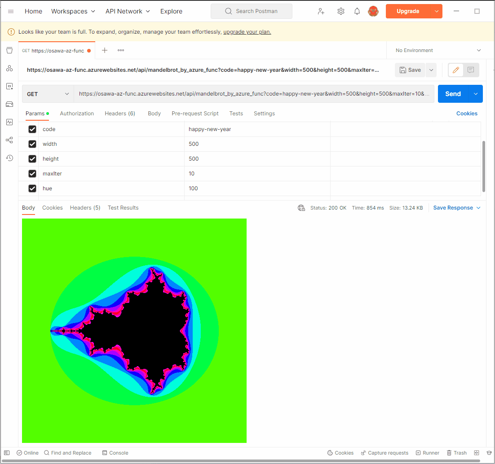

# mandelbrot_by_azure_func

🐧🐧🐧 `Azure Functions`でマンデルブロ集合を描写するAPIを実装する。  

  

指定可能なパラメタは以下の通り。  

| パラメタ | 説明 |
| ---- | ---- |
| width | 画像サイズ(縦幅) |
| height | 画像サイズ(横幅) |
| x0 | 実軸の最小座標 |
| y0 | 虚軸の最小座標 |
| x1 | 実軸の最大座標 |
| y1 | 虚軸の最大座標 |
| hue | 色相 |
| maxIter | 最大反復回数 |

パラメタはクエリパラメタとボディ部のJSONデータのどちらでも指定可能。  

`Azure Functions`の仕様上、widthに1億など巨大な数字を入力されてもタイムアウトが発生するため、パラメタのチェックはしていない。  
リクエストの回数のみが課金対象となっているため、一回の要求で大きな処理をしてもお財布は痛まない。  

## Azure Functionsへのデプロイ方法

[公式の拡張機能(VSCode)](https://marketplace.visualstudio.com/items?itemName=ms-azuretools.vscode-azurefunctions)を用いて簡単にデプロイ可能。  

資源グループを作成していない場合には、Azureポータルサイトから資源グループを作成し、「関数アプリ」を作成する。  
その中に、適当な名前の関数(ここでは"mandelbrot_by_azure_func")を作成し、このプロジェクトをアップロードする。  

これより下は、インストールした公式の拡張機能で実行可能。  
「A」のマークのメニュータブが左に表示されるので、これをクリック、AzureにサインインしてWORKSPACEの中にある雲のアイコンのデプロイボタンを押せばデプロイ完了。  

とっても簡単🐙🐙🐙  

## 参考資料

- [Getting started with Azure Functions](https://learn.microsoft.com/en-us/azure/azure-functions/functions-get-started?pivots=programming-language-csharp)
- [Quickstart: Create a C# function in Azure using Visual Studio Code](https://learn.microsoft.com/en-us/azure/azure-functions/create-first-function-vs-code-csharp)
